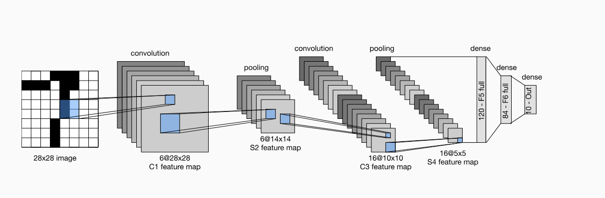
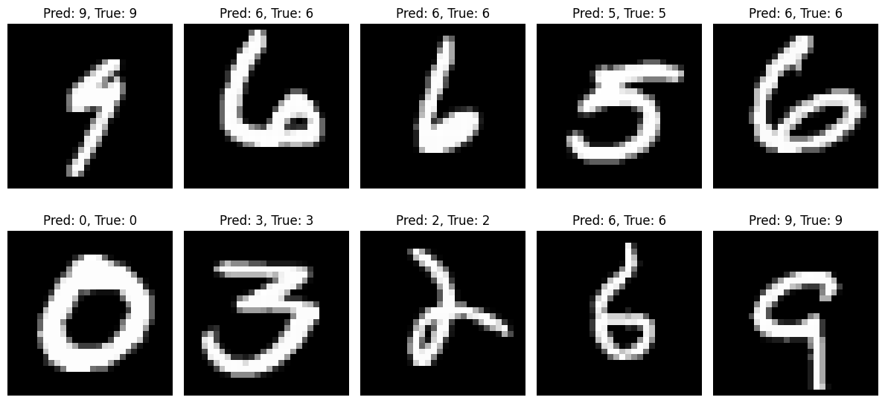

# LeNet-5 (1998) – NumPy Implementation from Scratch

In this project, I implemented the LeNet-5 convolutional neural network, both entirely from scratch in NumPy and replicated in PyTorch for practical GPU training. The goal is to predict handwritten digits.

## Dataset

- **Dataset**: MNIST (60k train / 10k test)  
- **Input size**: LeNet expects 32×32 greyscale images.  
  MNIST is 28×28, so we pad 2 pixels on each side in the first convolution layer.
  Normalized to [0,1] for NumPy version
  Standardized with mean=0.1307, std=0.3081 for PyTorch

## Architecture

| Layer      | Type                 | Parameters                             | Output Shape (input 28x28) |
| ---------- | -------------------- | -------------------------------------- | -------------------------- |
| **C1**     | Convolution          | 6 filters, 5×5 kernel, stride=1, pad=2 | (6, 28, 28)                |
|            | Activation (Tanh)    |                                        | (6, 28, 28)                |
| **S2**     | Average Pooling      | 2×2 window, stride=2                   | (6, 14, 14)                |
| **C3**     | Convolution          | 16 filters, 5×5 kernel, stride=1       | (16, 10, 10)               |
|            | Activation (Tanh)    |                                        | (16, 10, 10)               |
| **S4**     | Average Pooling      | 2×2 window, stride=2                   | (16, 5, 5)                 |
| **C5**     | Convolution          | 120 filters, 5×5 kernel, stride=1      | (120, 1, 1)                |
|            | Activation (Tanh)    |                                        | (120,)                     |
| **F6**     | Fully Connected      | 120 → 84                               | (84,)                      |
|            | Activation (Sigmoid) |                                        | (84,)                      |
| **Output** | Fully Connected      | 84 → 10                                | (10,)                      |

Image source: Zhang, Aston and Lipton, Zachary C. and Li, Mu and Smola, Alexander J. - https://github.com/d2l-ai/d2l-en

## NumPy Implementation

- Loaded and preprocessed MNIST from sklearn, normalized to [0,1], reshaped to (batch, 1, 28, 28), later padded to 32x32.
- Wrote functions for:
  - sigmoid, sigmoid_deriv, tanh, tanh_deriv, softmax
  - CrossEntropy loss
  - padding for convolution inputs
- Implemented:
  - Convolution layer forward & backward (manual multi-channel sum with for-loops, plus gradient calc for weights & inputs).
  - Average pooling forward & backward (distributes gradients uniformly).
- Used LeCun initialization for weights in tanh convolutional layers and Xavier scaled by 4 for sigmoid dense layers, with all biases initialized to zero.
- Training loop with SGD, explicit forward & backward passes, data shuffling each epoch.

Even after vectorizing, the convolution’s manual sliding windows with for loops were extremely slow. After 12 hours, not even a single epoch completed on my laptops CPU. I later went from 60,000 training images to 10,000 images.

## PyTorch Replication

To get practical results, I replicated the model in PyTorch and trained it on Kaggle’s GPUs (T4 x2).

- Normalized MNIST using mean=0.1307, std=0.3081.
- Used nn.Conv2d, nn.AvgPool2d, nn.Sigmoid, nn.Tanh, nn.Flatten, nn.Linear.
- Applied Xavier and LeCun initialization and DataParallel for multi-GPU.
- Trained with SGD and CrossEntropyLoss for 35 epochs.
- ~99% validation accuracy

## Conclusion

In this project, I successfully implemented the LeNet-5 architecture from scratch in Numpy, including forward and backward passes for convolutions, pooling, and fc layers. It was extremely slow so I trained on only 10,000 images. I then replicated it in PyTorch to train for a longer time. I made two mistakes that took me a long time to debug.

Backpropagation through padding:
Initially, I forgot to account for the padding applied in the first convolutional layer during backpropagation. This led to incorrect gradient computations because the backward pass was slicing over the original unpadded input, mismatching the forward pass, causing a stagnant 10% accuracy (randomly guessing). I fixed this by making my convolution function return the padded input, then making backpropagation use that padded input instead of the default input.

Mismatched activation functions and initialization:
After I fixed the padding error, it was still stagnant at 10% accuracy. I printed out the gradients and saw that all of them were tiny, on verge of vanishing. Even if they didn't vanish, updates would be ridiculously slow. I double checked the architecture and saw that I made a mistake. I used sigmoid activations across all layers, including the convolutional ones, with Xavier initialization. I thought LeNet-5 used only sigmoid as the activation function, but it actually used Tanh for the convolutional layers, and sigmoid for the fc layers. I fixed that and used LeCun as initialization for the convolutional layers, and Xavier initialization with a bit of scaling for the fc layers. This dramatically improved gradient flow and allowed the network to actually learn.

Replicated the architecture in PyTorch and trained it on a GPU, achieving ~99% accuracy.

This project gave me deep insights into the math, data flows, and engineering trade-offs behind CNNs. Even a relatively small CNN like LeNet-5 becomes computationally heavy to train purely from scratch on CPU. This exercise was invaluable to truly understand what frameworks like PyTorch do under the hood.

Results from the NumPy CNN:

Built by Kaizen Rowe